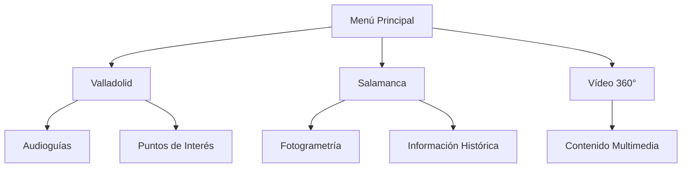

# 🕶️ VR Patrimonio Inclusivo

### Exploración inmersiva del patrimonio histórico de Valladolid y Salamanca

[](https://unity.com/)
[](https://learn.microsoft.com/es-es/dotnet/csharp/)
[](https://www.meta.com/)
[](#)

## 📖 Descripción

VR Patrimonio Inclusivo es una experiencia de realidad virtual desarrollada para Meta Quest 3 que permite visitar virtualmente algunos de los lugares históricos más emblemáticos de Valladolid y Salamanca.

El proyecto nace de la colaboración entre el Centro Gregorio Fernández, la Universidad de Valladolid (UVa) y la Universidad de Salamanca (USAL), con el objetivo de acercar el patrimonio cultural a personas con movilidad reducida o dificultades para desplazarse físicamente.

La aplicación funciona de forma autónoma en Meta Quest 3, sin necesidad de ordenador externo.

---

## 🎯 Objetivos

* Facilitar el acceso al patrimonio cultural mediante realidad virtual.
* Eliminar barreras arquitectónicas para personas con diversidad funcional.
* Ofrecer una experiencia inmersiva intuitiva y accesible.
* Mantener una tasa estable de rendimiento en dispositivos VR standalone.
* Incorporar contenidos educativos mediante audioguías interactivas.

---

## ✨ Funcionalidades

### 🏛️ Visitas Virtuales

* Recorrido interactivo por Valladolid.
* Recorrido interactivo por Salamanca.
* Entornos optimizados para Meta Quest 3.

### 🎧 Audioguías Inteligentes

* Narraciones automáticas en español e inglés.
* Activación mediante proximidad.
* Sistema anti-solapamiento de audios.

### 🌍 Sistema Multilenguaje

* Cambio instantáneo de idioma.
* Persistencia de preferencias del usuario.
* Español e inglés incluidos.

### 🎥 Experiencias 360°

* Reproducción de vídeos inmersivos.
* Skybox esférico de alta resolución.
* Integración dentro de la experiencia VR.

### ♿ Accesibilidad

* Movimiento reducido para evitar mareos.
* Textos de gran tamaño.
* Interfaz simplificada.
* Navegación apta para usuarios mayores.

---

## 🏗️ Arquitectura del Proyecto



## 🛠️ Tecnologías Utilizadas

### Desarrollo

* Unity 2022.3 LTS
* C#
* OpenXR
* Meta XR SDK
* Plastic SCM

### Modelado y Multimedia

* Fotogrametría mediante drones
* Optimización Low Poly
* Vídeo 360°
* Sistemas de partículas optimizados

### Inteligencia Artificial

| Herramienta | Uso                                    |
| ----------- | -------------------------------------- |
| Meshy AI    | Modelado 3D                            |
| ElevenLabs  | Locuciones                             |
| Gemini      | Redacción y optimización de contenidos |

---

## 📊 Resultados de Validación

El proyecto fue evaluado por 9 usuarios de entre 8 y 81 años.

### Aspectos validados

✅ Facilidad de uso

✅ Comprensión de la interfaz

✅ Confort visual

✅ Rendimiento en Meta Quest 3

✅ Accesibilidad para usuarios de edad avanzada

---

## ⚡ Rendimiento

| Métrica         | Resultado      |
| --------------- | -------------- |
| Plataforma      | Meta Quest 3   |
| FPS objetivo    | 72 FPS         |
| Resolución      | Nativa Quest 3 |
| Tiempo de carga | < 5 s          |
| Mareo reportado | Muy bajo       |

---

## 🚀 Instalación

### Requisitos

* Unity 2022.3 LTS
* Android Build Support
* Meta XR SDK
* Meta Quest 3
* Cable USB-C

### Compilación

```bash
git clone https://github.com/usuario/repositorio.git
```

1. Abrir el proyecto en Unity.
2. Cambiar plataforma a Android.
3. Activar el modo desarrollador en Quest 3.
4. Conectar el visor.
5. Pulsar **Build and Run**.

---

## 👥 Entidades Colaboradoras

* Centro Gregorio Fernández
* Universidad de Valladolid
* Universidad de Salamanca

---

## 📄 Licencia

Proyecto académico desarrollado con fines educativos y de accesibilidad cultural.
