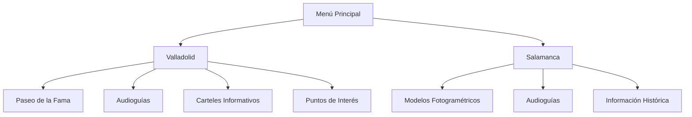

# 📖 Descripción

**VR Patrimonio Inclusivo** es una experiencia de Realidad Virtual desarrollada para Meta Quest 3 que permite visitar virtualmente algunos de los lugares históricos más emblemáticos de Valladolid y Salamanca.

El proyecto surge de una colaboración interdisciplinar entre alumnado del **CFGS de Desarrollo de Aplicaciones Multiplataforma (DAM)** y alumnado del **CFGS de Guía, Información y Asistencias Turísticas**, combinando conocimientos tecnológicos y turísticos para crear una experiencia cultural inmersiva accesible para todos los públicos.

La aplicación funciona de forma autónoma en Meta Quest 3, sin necesidad de ordenador externo, permitiendo a los usuarios recorrer entornos históricos digitalizados mediante fotogrametría y acceder a información cultural mediante audioguías interactivas.

---

# 🎯 Objetivos

* Facilitar el acceso al patrimonio cultural mediante Realidad Virtual.
* Acercar el patrimonio histórico a personas con movilidad reducida o dificultades de desplazamiento.
* Ofrecer una experiencia inmersiva intuitiva y accesible.
* Mantener una tasa estable de rendimiento en dispositivos VR Standalone.
* Incorporar contenidos educativos mediante audioguías interactivas.
* Fomentar la colaboración entre perfiles tecnológicos y turísticos mediante un proyecto multidisciplinar.

---

# 🏗️ Arquitectura del Proyecto

### Menú Principal

El usuario selecciona la ciudad que desea visitar mediante una interfaz adaptada para Realidad Virtual.

### Valladolid

La experiencia de Valladolid incorpora:

* Paseo de la Fama con personajes históricos destacados.
* Audioguías activadas por proximidad.
* Carteles informativos interactivos.
* Puntos de interés distribuidos por el recorrido.

### Salamanca

La experiencia de Salamanca se centra en:

* Modelos fotogramétricos optimizados para Meta Quest 3.
* Audioguías bilingües.
* Información histórica contextual.
* Exploración libre del entorno patrimonial.

---

# 👥 Colaboración Interdisciplinar

Este proyecto ha sido desarrollado mediante la colaboración entre distintos perfiles educativos y tecnológicos:

* Centro Gregorio Fernández.
* CFGS de Desarrollo de Aplicaciones Multiplataforma (DAM).
* CFGS de Guía, Información y Asistencias Turísticas.
* Participantes especializados en patrimonio histórico y difusión cultural.

Esta colaboración ha permitido combinar el desarrollo tecnológico de la aplicación con la investigación, documentación y elaboración de contenidos turísticos e históricos.
